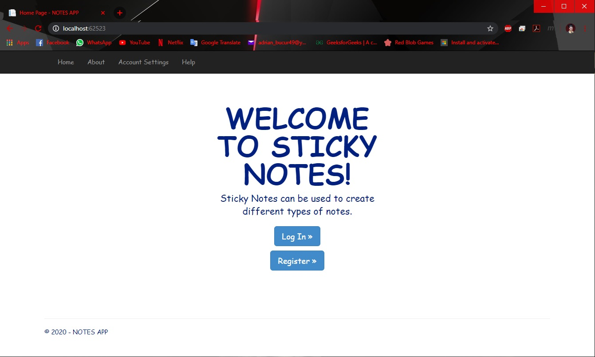
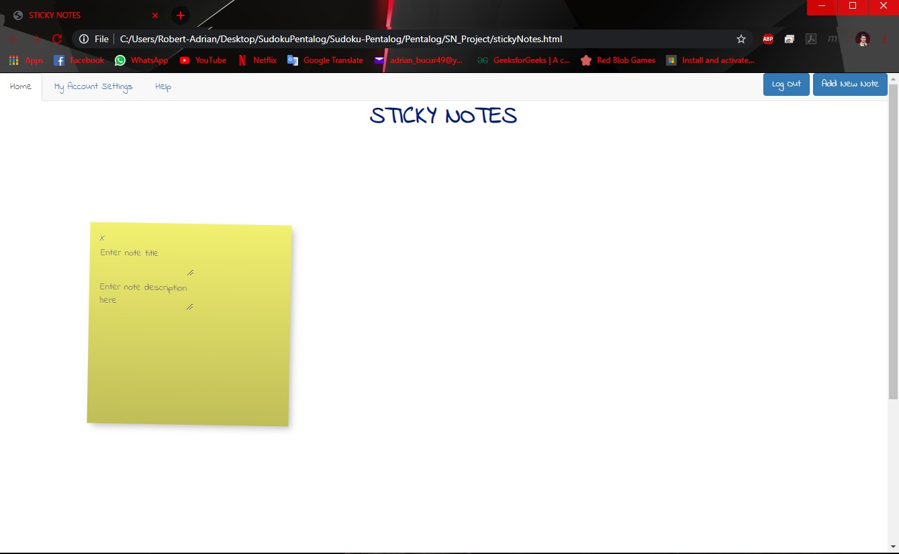
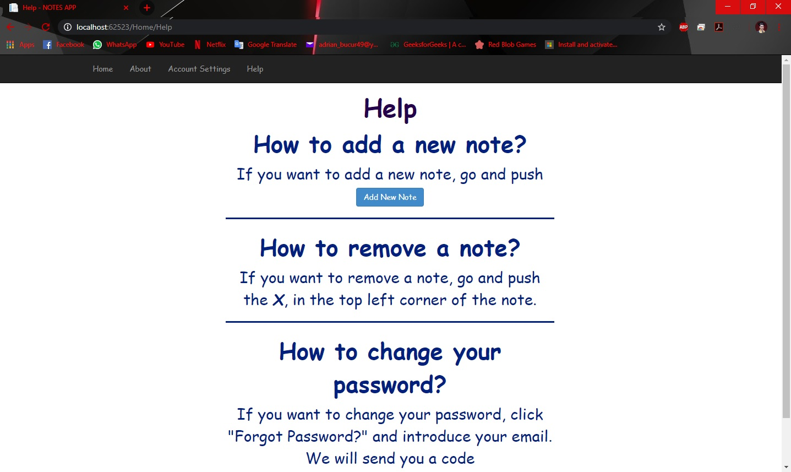
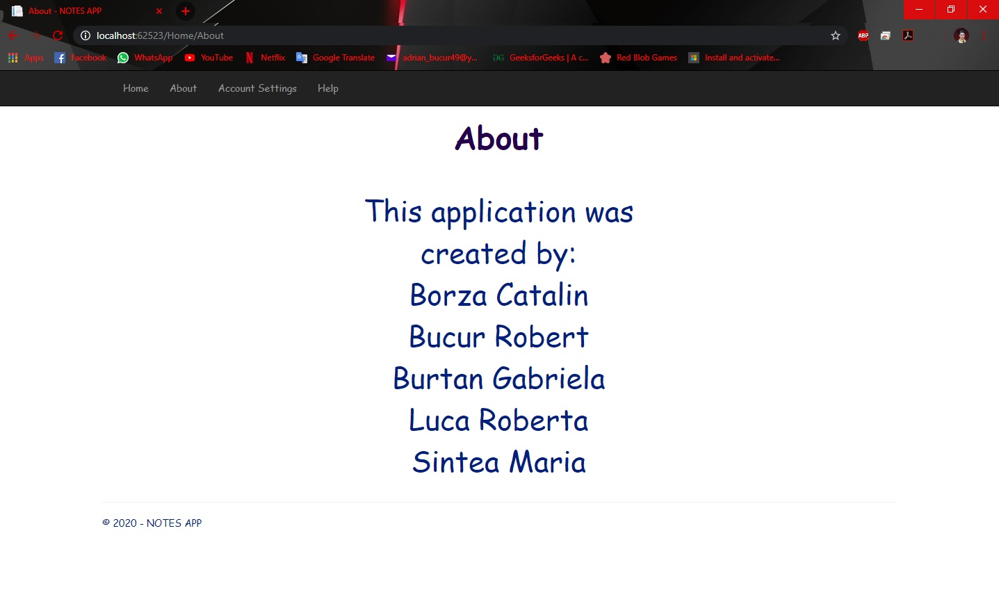

# Sticky Notes

- This project is an implementation of the app Sticky Notes in HTML, CSS and BootsTrap using Visual Studio.
- This project was a teamwork project within the program Estival Experience 2017 organised by Pentalog Romania.

The app looks like this:
- The home page with login:

- The home page in app:

- The help page:

- The about page (where is listed the team):

